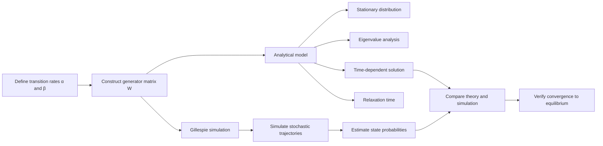

# Markov Processes and Gillespie Algorithm

Analytical and stochastic study of a two-state continuous-time Markov process using master equations, spectral analysis and Gillespie simulation.

The project combines an analytical treatment of the Markov process with a stochastic simulation and compares the simulated probability evolution with the exact solution.

---

## Overview

The system has two states with transition rates

$$
W(1 \to 2)=\alpha,
\qquad
W(2 \to 1)=\beta
$$

where

$$
\alpha>0,
\qquad
\beta>0
$$

The state-probability vector is

$$
p(t)=
\begin{pmatrix}
p_1(t) \\
p_2(t)
\end{pmatrix}
$$

The aim is to understand how the probabilities evolve with time, determine the stationary distribution, analyse convergence to equilibrium, and verify the theory using Gillespie simulation.

---

## Master Equation

For state 1,

$$
\frac{dp_1}{dt}
=
\beta p_2-\alpha p_1
$$

For state 2,

$$
\frac{dp_2}{dt}
=
\alpha p_1-\beta p_2
$$

The system can therefore be written as

$$
\frac{dp}{dt}
=
Wp(t)
$$

with generator matrix

$$
W=
\begin{pmatrix}
-\alpha & \beta \\
\alpha & -\beta
\end{pmatrix}
$$

The generator has several important properties:

- each column sums to zero, conserving total probability
- the off-diagonal entries are non-negative
- one eigenvalue is zero
- the second eigenvalue is strictly negative

---

## Probability Conservation

Since the columns of $W$ sum to zero,

$$
\frac{d}{dt}
\left(
p_1(t)+p_2(t)
\right)
=
0
$$

Therefore,

$$
p_1(t)+p_2(t)=1
$$

for all $t$, provided the initial distribution is normalised.

---

## Eigenvalues

The characteristic equation is

$$
\det(W-\lambda I)=0
$$

For this generator,

$$
\det(W-\lambda I)
=
\lambda(\lambda+\alpha+\beta)
$$

so the eigenvalues are

$$
\lambda_1=0,
\qquad
\lambda_2=-(\alpha+\beta)
$$

Since $\alpha,\beta>0$,

$$
\lambda_2<0
$$

The zero eigenvalue corresponds to the stationary state, while the negative eigenvalue governs relaxation toward equilibrium.

---

## Stationary Distribution

The stationary distribution $\pi$ satisfies

$$
W\pi=0
$$

where

$$
\pi=
\begin{pmatrix}
\pi_1 \\
\pi_2
\end{pmatrix}
$$

together with

$$
\pi_1+\pi_2=1
$$

Solving

$$
-\alpha\pi_1+\beta\pi_2=0
$$

gives

$$
\pi_2
=
\frac{\alpha}{\beta}\pi_1
$$

and therefore

$$
\pi_1
=
\frac{\beta}{\alpha+\beta}
$$

and

$$
\pi_2
=
\frac{\alpha}{\alpha+\beta}
$$

Hence

$$
\pi=
\begin{pmatrix}
\dfrac{\beta}{\alpha+\beta} \\
\dfrac{\alpha}{\alpha+\beta}
\end{pmatrix}
$$

---

## Parameters Used

The simulation uses

$$
\alpha=0.3,
\qquad
\beta=0.5
$$

Therefore,

$$
\pi_1
=
\frac{0.5}{0.3+0.5}
=
0.625
$$

and

$$
\pi_2
=
\frac{0.3}{0.3+0.5}
=
0.375
$$

so

$$
\pi=
\begin{pmatrix}
0.625 \\
0.375
\end{pmatrix}
$$

---

## Eigenvectors

For the zero eigenvalue,

$$
\lambda_1=0
$$

the right eigenvector is the stationary distribution

$$
v_1=
\begin{pmatrix}
\pi_1 \\
\pi_2
\end{pmatrix}
$$

The corresponding left eigenvector is

$$
u^T=(1,1)
$$

which reflects conservation of total probability.

For

$$
\lambda_2=-(\alpha+\beta)
$$

a corresponding right eigenvector is

$$
v_2=
\begin{pmatrix}
-1 \\
1
\end{pmatrix}
$$

---

## Detailed Balance

Detailed balance requires

$$
\pi_1W(1\to2)
=
\pi_2W(2\to1)
$$

Using the transition rates,

$$
\pi_1\alpha
=
\pi_2\beta
$$

Substituting the stationary probabilities gives

$$
\frac{\beta}{\alpha+\beta}\alpha
=
\frac{\alpha}{\alpha+\beta}\beta
$$

Both sides are equal to

$$
\frac{\alpha\beta}{\alpha+\beta}
$$

so the process satisfies detailed balance.

---

## KL Divergence and Convergence

The Kullback-Leibler divergence between $p(t)$ and the stationary distribution $\pi$ is

$$
D(p(t)\|\pi)
=
\sum_{n=1}^{2}
p_n(t)
\log
\left(
\frac{p_n(t)}{\pi_n}
\right)
$$

For the two-state model,

$$
D(p(t)\|\pi)
=
p_1(t)
\log
\left(
\frac{p_1(t)}{\pi_1}
\right)
+
p_2(t)
\log
\left(
\frac{p_2(t)}{\pi_2}
\right)
$$

Using the master equations and detailed balance,

$$
\frac{d}{dt}D(p(t)\|\pi)
=
-
(p_1\alpha-p_2\beta)
\log
\left(
\frac{p_1\alpha}{p_2\beta}
\right)
$$

Using

$$
(e^x-e^y)(x-y)\ge0
$$

gives

$$
\frac{d}{dt}D(p(t)\|\pi)
\le0
$$

Therefore, the KL divergence is non-increasing and acts as a Lyapunov function.

Equality occurs only when

$$
p_1\alpha=p_2\beta
$$

which is the stationary condition.

Hence,

$$
\lim_{t\to\infty}p(t)=\pi
$$

---

## Symmetric Reformulation

The generator can be transformed into the symmetric matrix

$$
M=
\begin{pmatrix}
-\alpha & \sqrt{\alpha\beta} \\
\sqrt{\alpha\beta} & -\beta
\end{pmatrix}
$$

through the similarity transform

$$
M=D^{-1}WD
$$

where $D$ is diagonal with entries related to the square roots of the stationary probabilities.

Since $M$ is real and symmetric, it is diagonalisable by the spectral theorem.

Defining

$$
q(t)=D^{-1}p(t)
$$

gives

$$
\frac{dq}{dt}
=
Mq(t)
$$

---

## Time-Dependent Solution

The full solution is

$$
p_1(t)
=
\pi_1+
\left(
p_1(0)-\pi_1
\right)
e^{-(\alpha+\beta)t}
$$

and

$$
p_2(t)
=
\pi_2+
\left(
p_2(0)-\pi_2
\right)
e^{-(\alpha+\beta)t}
$$

The transient term decays exponentially at rate

$$
\alpha+\beta
$$

so

$$
p(t)\to\pi
\qquad
\text{as }
t\to\infty
$$

---

## Relaxation Time

The non-zero eigenvalue is

$$
\lambda_2=-(\alpha+\beta)
$$

Therefore, the characteristic relaxation time is

$$
\tau_{\mathrm{relax}}
=
\frac{1}{|\lambda_2|}
=
\frac{1}{\alpha+\beta}
$$

For the simulation parameters,

$$
\tau_{\mathrm{relax}}
=
\frac{1}{0.3+0.5}
=
1.25
$$

Larger transition rates therefore lead to faster convergence toward equilibrium.

---

## Gillespie Algorithm

The Gillespie algorithm simulates individual stochastic trajectories of the continuous-time Markov process.

When the process is in a state, the waiting time before the next transition is exponentially distributed.

The waiting time is generated using

```python
tau = np.random.exponential(1.0 / rate)
```

For this two-state model:

- state 1 has outgoing rate $\alpha$
- state 2 has outgoing rate $\beta$
- each transition moves the process to the opposite state

The experiment uses

```text
alpha = 0.3
beta = 0.5
t_end = 15
trajectories = 10000
time bins = 300
starting state = 1
```

The probabilities $p_1(t)$ and $p_2(t)$ are estimated by averaging over 10,000 independent trajectories.

---

## Simulation Results

For

$$
\alpha=0.3,
\qquad
\beta=0.5
$$

the analytical stationary probabilities are

$$
\pi_1=0.6250
$$

and

$$
\pi_2=0.3750
$$

The submitted Gillespie experiment produced simulated stationary values of approximately

$$
p_1=0.6247
$$

and

$$
p_2=0.3753
$$

The simulated curves closely overlap the analytical solution, showing that Gillespie simulation accurately reproduces the theoretical probability dynamics.

---

## Project Workflow



---

## Repository Structure

```text
markov-processes-gillespie/
│
├── README.md
├── requirements.txt
├── .gitignore
├── run_simulation.py
│
├── src/
│   ├── __init__.py
│   └── gillespie.py
│
└── results/
    └── README.md
```

### `src/gillespie.py`

Contains:

- Gillespie trajectory simulation
- probability estimation across trajectories
- analytical time-dependent solution

### `run_simulation.py`

Runs the main experiment and generates the analytical-versus-simulation comparison plot.

---

## Running the Project

Clone the repository:

```bash
git clone https://github.com/aamina-ahmad/markov-processes-gillespie.git
```

Move into the project:

```bash
cd markov-processes-gillespie
```

Install dependencies:

```bash
pip install -r requirements.txt
```

Run the simulation:

```bash
python run_simulation.py
```

On Windows:

```bash
py -m pip install -r requirements.txt
py run_simulation.py
```

The comparison figure is saved to

```text
results/gillespie_vs_analytical.png
```

---

## Technologies

- Python
- NumPy
- Matplotlib
- Continuous-time Markov chains
- Gillespie algorithm
- Stochastic simulation
- Eigenvalue analysis
- Linear ODE systems

---

## Quantitative Relevance

Continuous-time Markov processes appear in many quantitative modelling problems, including:

- regime-switching models
- credit-rating transitions
- default-state modelling
- queueing systems
- reliability modelling
- event-driven stochastic systems

The project demonstrates two complementary views of a stochastic process:

**Distribution level:** the master equation determines how probabilities evolve.

**Pathwise level:** the Gillespie algorithm generates individual random trajectories.

Averaging many trajectories recovers the deterministic probability dynamics predicted by the master equation.

---

## Key Takeaways

- The generator matrix conserves total probability.
- The zero eigenvalue determines the stationary distribution.
- The negative eigenvalue determines the relaxation rate.
- Detailed balance holds for the two-state process.
- KL divergence provides a Lyapunov convergence argument.
- The probability distribution approaches equilibrium exponentially.
- Gillespie simulation closely reproduces the analytical solution.

---

## Disclaimer

This repository is an educational and portfolio project focused on stochastic processes and simulation.

All trajectories are synthetically generated from the specified transition rates.
